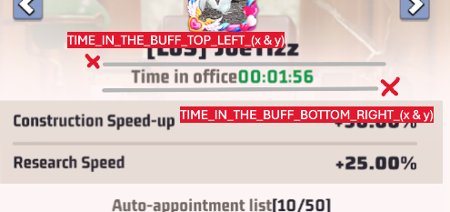

# BOT for Last War (do Vice-president)

## Requirements

1. An account with a player level 16 at least (to get capitol buff). Do it with a 2nd account (possible ban).
2. Set display resolution of windows screen **1920x1080** and your emulator (BlueStacks for example) to: **1280x720** vertically
3. Set the language game to **French** (screenshots are in French)
4. Works perfectly with Windows11 **BUT** if you use MacOS or Linux, the installation will be different, **watch out**

## Installations

1. Install the programming language [Python](https://www.python.org/downloads/),
2. Open the terminal command in administrator mode and write:
   1. pip install pyautogui
   2. pip install pillow
   3. pip install opencv-python
   4. pip install pytesseract
3. Now install **tesseract** on windows. More complicated so watch this video (https://www.youtube.com/watch?v=HNCypVfeTdw)

## Global configuration

In the **config.json** file, you can configure lots of things !

1. (if you want to ban some alliances) You can set the alliance's name in **blacklist_alliances** (ex: "CyS")
2. (if you want to ban some players) You can give a nickname to some players in game. Do it before set player's name in **blacklist_players** (ex: "BANYolKal").
3. **max_time_player_has_buff_in_minute** you can kick a player with the bot after that the player has the buff until x minutes
4. **click_interval_in_second** useful to have random interval between clicks to have a more human behaviour

## Before Starting the bot

1. You may have to modify pixel positions variables into the **constants.py** file to perfectly fit with your window:
   1. Set the emulator window as you want and don't change it anymore (or update variables again)
   2. type **python getPosition.py** in your terminal and move your mouse over the relevant area (you have 2 seconds to switch window et move your mouse). You'll be able to see in the terminal X position and Y position, then modify variables numbers.
   3. **PROFILE_PICTURE** is on the top left corner (little profile picture). Place your mouse in the center and modify variables.
   4. **STRATEGY BUFF, SECURITY BUFF, etc.** is all cards buffs in the buff page. Place your mouse in the center for each cards and modify variables.
   5. **TIME_IN_THE_BUFF...** place your mouse on the red crosses (see picture below) and modify variables. 
2. In game:
   1. Click on your profile
   2. Click on #serverNumber (#477)
   3. Open capitole buffs interface
   4. Be vice-president
   5. Start the bot (terminal / VSCode with **administrator mode**)

## Start bot

1. Don't do anything while script is running.
2. **To stop the script:** close your terminal or set your mouse on the corner of the screen (top right for example) for the **"fail-safe"**.
3. Open new terminal or VSCode with **administrator rights**
4. Start the script: **python startBot.py**

## What doing if it doesn't work ?

It may happend that the script can't find images (ex: waiting-list-button not found).

The resolution of Windows and/or the emulator may cause issues (even if the screen are zoomed or someting like that). It can't find the image because images are a bit bigger and smaller.

The easiest way it to try to change Window and emulator resolution or to change screenshots by yourself. Be sure to keep the same name that before.

## How to update the bot ?

There's many ways to do that:

- Either by me, so you just have to update the main branch with: **git pull**
- Or by youself but I promise it's not so tricky :D
  - Just **make new screenshots** for update images into the images folder (Last war may update UI buttons)
  - Your screen resolution changed so the script can't click on the right positions so it's faster to **update pixel variables** by yourself directly. Call GetPosition to get X and Y positions with **python getPosition.py** (as explained in "Before Starting the bot")

## Is it work perfectly ?

No, the bot can make mistakes because it uses OCR techniques and these techniques are not 100% reliable (especially tesseract).

Last war includes a system anti bot now to make bot and macro-clicker crazy. So I created CheckAndCloseAntiBotModal function that close the anti bot modal

Watch out to game updates! You have to restart the game and the script.

## Limitations

Watch out if the script run on a server.

PyAutoGUI requires a graphical environment to function. On a server without a screen, this can be problematic. However, you can use solutions like Xvfb (X Virtual Framebuffer) to create a virtual graphics environment. You'll have to make changes by yourself.
